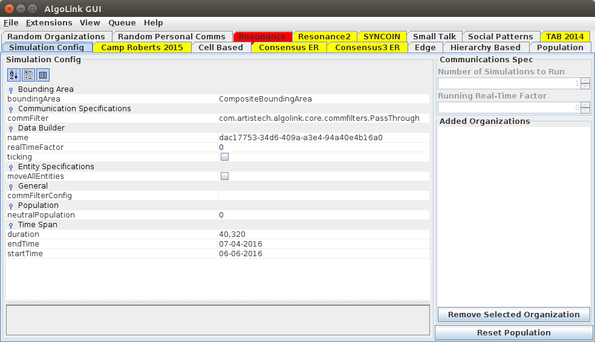

# AlgoLink Documentation and Examples

- [Corporate Website](http://artistech.com/)
- [AlgoLink Website](http://artistech.com/algolink.html)

AlgoLink is an event-driven, agent-inspired framework for modeling simulations involving entities in varying social organizations and groups. 

## Controlled Message DB Generation for Intel Application. Testing.

There are many tools being tested to "find the right connections within the very large databases of information in the Intel domain. An ongoing problem is the test set, the data that gets used to compare one mining method against another.

Testing with "real" Intel Data is not a good option:

- Data sets can be too big
- Content is unknown at the outset of the test
- The data does not span all possibilities
- The classification level of the data often prohibits access by academic experts seeking to improve information processing techniques

ArtisTech's AlgoLink solves this problem by using an intentionally structured message set development routines.

Algolink rapidly produces realistic, structured, gritty datasets to test analytic performance of new data mining applications or approaches.

- Knowing the Test DB Enables Merit Evaluation

AlgoLink makes it easy to create challenging DB Search Tests

- Contains Expandable Social Structures
- Uses Several Complexity Generators
- Can Generate Message DB's in real-Time, or bulk

Algolink generates entity-link-position-content-time messages from social-structure

- User Specified Entity Groups with Behavior
- User-Specified Timeframes and Frequency of Links
- "Dirt", Randomness, and Drop-outs Added Under User Control
- Timing and Other Elements "Jittered" by Chaos

AlgoLink eliminates simple auto-generated message structures which would make it easy for most Analysis applications and approaches to find the embedded test "bad-guys".

## Documentation

- [Development](development/)
- [Distributed/Enterprise](distributed.md)
- [Integration with third-party applications](integration.md)
- [Configuring Logging](logging.md)
- [User Cases](UseCases/)
    - [Camp Roberts 2015](UseCases/camproberts2015.md)
    - [Test Server Instance](UseCases/server-test-instance.md)
    - [Initializing a Simulation](UseCases/simulation-initialization.md)
- [Options](options.md)
- [Requirements](requirements.md)
    - [Tomcat](tomcat.md)
